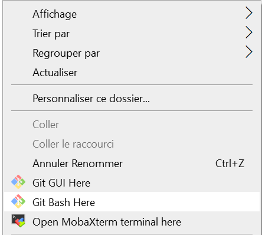
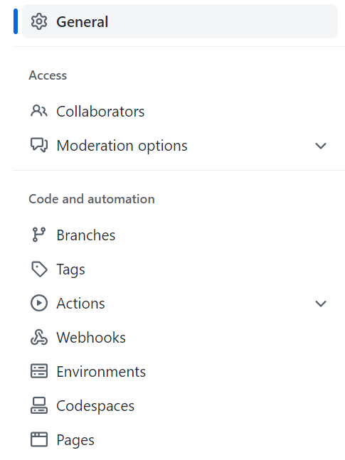
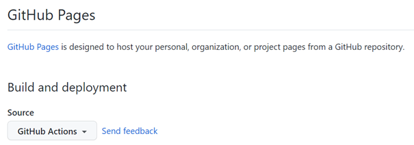

# Hugo CMS

Dans cette documentation vous trouverez la procedure pour monter un site en HTML/CSS heberger gratuitement sur Github. La procedure est écrite pour un déploiement sur windows 10. Des bases en Git sont recommandées.


## Prérequis

- [Github](https://github.com/)

- [Git](https://git-scm.com/book/en/v2/Getting-Started-Installing-Git)

- [Go](https://github.com/baha1218/HadoopDatanode)

- [Hugo](https://gohugo.io/installation/windows/) (Si vous avez du mal avec l'ajout de la variable d'envirronnement, voici une [source complementaire](https://www.youtube.com/watch?v=C04dlR1Ufj4&ab_channel=PyLenin))

## 🛠 Configuration

### Créer un site Hugo en local

Rendez vous dans le dossier dans lequel vous stocker vos différent repository puis `clic droit`/ `git bash here`


Tapez les commandes suivantes : 


```bash
hugo new site HugoCMS
cd HugoCMS
git init
git submodule add https://github.com/theNewDynamic/gohugo-theme-ananke themes/ananke
echo "theme = 'ananke'" >> config.toml
```

Vous pouvez maintenant visualiser votre site grace à la commande `hugo server` qui vous fournira l'url de votre site en local

### Déployer un site Hugo en sur Github

Tout d'abord, pushez votre repository sur Github grace au Gitbash ou à votre Github Desktop.

Rendez vous ensuite sur Github dans les settings de votre repository. Selectionnez l'onglet Action


Modifiez la source de `Build and Deploy` en `Github Action`.



## Source

- https://gohugo.io/getting-started/quick-start/
- https://gohugo.io/hosting-and-deployment/hosting-on-github/- 