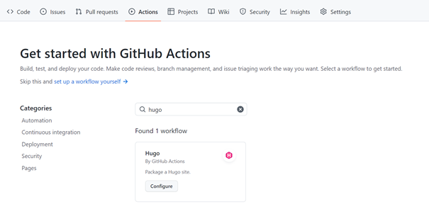
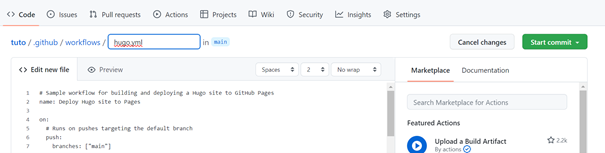

# Hugo CMS

Dans cette documentation vous trouverez la procedure pour monter un site en HTML/CSS heberger gratuitement sur Github. La procedure est écrite pour un déploiement sur windows 10. Des bases en Git sont recommandées.


## Prérequis

- [Github](https://github.com/)

- [Git](https://git-scm.com/book/en/v2/Getting-Started-Installing-Git)

- [Go](https://github.com/baha1218/HadoopDatanode)

- [Hugo](https://gohugo.io/installation/windows/) (Si vous avez du mal avec l'ajout de la variable d'envirronnement, voici une [source complementaire](https://www.youtube.com/watch?v=C04dlR1Ufj4&ab_channel=PyLenin))

## 🛠 Configuration

### Créer un site Hugo en local

Rendez vous dans le dossier dans lequel vous stocker vos différent repository puis `clic droit`/ `git bash here`


Tapez les commandes suivantes : 


```bash
hugo new site HugoCMS
cd HugoCMS
git init
git submodule add https://github.com/theNewDynamic/gohugo-theme-ananke themes/ananke
echo "theme = 'ananke'" >> config.toml
```

Vous pouvez maintenant visualiser votre site grace à la commande `hugo server` qui vous fournira l'url de votre site en local.

### Déployer un site Hugo en sur Github

Tout d'abord, pushez votre repository sur Github grace au Gitbash ou à votre Github Desktop.

Rendez vous ensuite sur Github dans les settings de votre repository. Selectionnez l'onglet Action.


Modifiez la source de `Build and Deploy` en `Github Action`.

Ensuite dans action ; rechercher workflow hugo cms et commiter le fichier hugo.yml
Ce workflow va créer pour vous le fichiers hugo.yaml et son arborescene



### Tester le site

Dans mon cas mon username Github est `baha1218` et le nom du repo est `HugoCMS` donc mon url est https://baha1218.github.io/HugoCMS . Le site fonctionnne !

Retournez dans le dossier avec vos repository sur votre pc et  editez le fichier config.toml pour changer le tittle
après un nouveau commit, vous pouvez suivre l’action et vérifier le changement.



Félicitation, vous pouvez créer un site en CI/CD hébergé sur Github

## Source

- https://gohugo.io/getting-started/quick-start/
- https://gohugo.io/hosting-and-deployment/hosting-on-github/